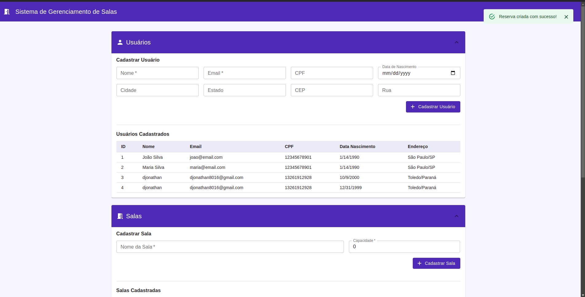

# 🏢 Sistema de Controle de Salas



Sistema de gerenciamento de reservas de salas baseado em arquitetura de microserviços com comunicação assíncrona.

## 📋 Visão Geral

O sistema permite o gerenciamento completo de usuários, salas e reservas através de uma arquitetura distribuída composta por microserviços que se comunicam via REST e mensageria.

### 🔧 Microserviços

| Serviço        | Responsabilidade          | Porta |
| -------------- | ------------------------- | ----- |
| **ms-usuario** | Gerenciamento de usuários | 8080  |
| **ms-sala**    | Gerenciamento de salas    | 8081  |
| **ms-reserva** | Orquestração de reservas  | 8082  |

## 🚀 Como Executar

### 📋 Pré-requisitos

- [Docker](https://docs.docker.com/get-docker/) (versão 20.10+)
- [Docker Compose](https://docs.docker.com/compose/install/) (versão 2.0+)
- 8GB RAM disponível
- Portas livres: 80, 3000, 3307-3309, 4040, 5672, 8080-8082, 15672

### ⚡ Execução Rápida

```bash
# Clone o repositório
git clone https://github.com/LuizPagliari/controle-sala.git
cd controle-sala

# Execute o ambiente completo
docker-compose up --build -d
```

### 🌐 Acessos do Sistema

| Serviço                 | URL                    | Descrição                        |
| ----------------------- | ---------------------- | -------------------------------- |
| **Frontend**            | http://localhost:3000  | Interface principal do usuário   |
| **API Gateway**         | http://localhost       | Nginx reverse proxy              |
| **Adminer**             | http://localhost:4040  | Gerenciamento de bancos de dados |
| **RabbitMQ Management** | http://localhost:15672 | Dashboard do message broker      |

### 🗄️ Credenciais de Acesso

#### Bancos de Dados (Adminer)

- **Usuário**: `admin`
- **Senha**: `123`
- **Bancos**: `db_usuario`, `db_sala`, `db_reserva`

#### RabbitMQ

- **Usuário**: `admin`
- **Senha**: `admin`

### Criando Usuário

```json
{
  "nome": "João Silva",
  "email": "joao@email.com",
  "cpf": "12345678901",
  "dataNascimento": "1990-01-15",
  "endereco": {
    "cidade": "São Paulo",
    "estado": "SP",
    "cep": "01234567",
    "rua": "Rua das Flores, 123"
  }
}
```

### Criando Sala

```json
{
  "nome": {
    "nome": "Sala de Reunião A"
  },
  "capacidade": {
    "capacidade": 10
  }
}
```

### Criando Reserva

```json
{
  "dataHora": "2025-06-15T14:30:00",
  "salaId": 1,
  "usuarioId": 1
}
```